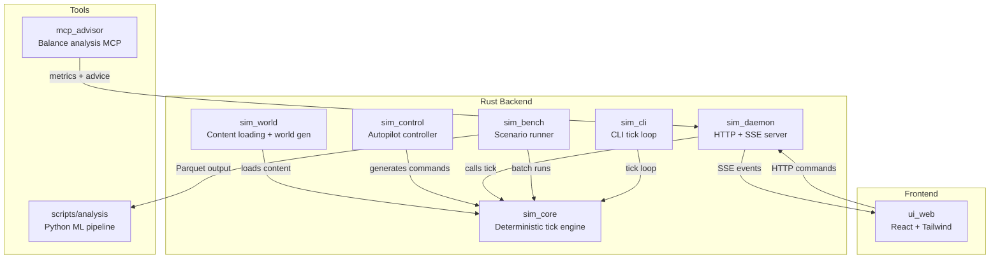
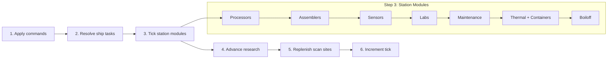

# Space Simulation

Deterministic space industry simulation game. Mine asteroids, refine materials, research technology, manufacture components, and manage thermal processing chains — all running as a tick-based simulation with a React mission control UI.

## Architecture



## Crate Dependency Chain

```
sim_core  <--  sim_control  <--  sim_cli
    ^              ^               sim_daemon
    |              |
  sim_world     sim_bench
```

- **sim_core** — Pure deterministic simulation. No IO. Takes `&mut Rng` for randomness. Public API: `tick()`.
- **sim_control** — `AutopilotController` with trait-based behaviors (deposit, mine, crew assignment, module management).
- **sim_world** — `load_content()` from `content/*.json` + `build_initial_state()`.
- **sim_daemon** — axum HTTP server with SSE streaming, pause/resume, command queue.
- **sim_bench** — Scenario runner with JSON overrides, parallel seeds via rayon, Parquet + CSV output.
- **ui_web** — Vite + React 19 + TypeScript + Tailwind v4. Draggable panels, SSE streaming.

## Tick Order



## Key Systems

| System | Description | Key Files |
|--------|-------------|-----------|
| **Mining** | Ships survey/mine asteroids, deposit ore at stations | `tasks.rs`, `commands.rs` |
| **Refinery** | Processors consume ore, produce refined materials | `station/processor.rs` |
| **Manufacturing** | Multi-tier recipes: ore -> plates -> beams -> hull panels | `station/assembler.rs`, `recipes.json` |
| **Research** | Labs consume raw data, produce domain-specific research points | `research.rs`, `station/lab.rs` |
| **Thermal** | Smelters, radiators, crucibles, phase transitions | `station/thermal.rs`, `thermal.rs` |
| **Crew** | Typed crew pools as module operation constraints | `commands.rs` (assign/unassign) |
| **Economy** | Import/export via trade, balance tracking | `trade.rs`, `pricing.json` |
| **Power** | Solar arrays, batteries, power-stall priority | `station/mod.rs` |
| **Wear** | 3-band efficiency degradation, maintenance bay repairs | `wear.rs`, `station/maintenance.rs` |

## Content-Driven Design

Game content is defined in JSON files under `content/`:

```
content/
  module_defs.json     # Module types, behaviors, thermal properties, crew requirements
  recipes.json         # Processing/assembly/casting recipes with inputs/outputs
  techs.json           # Tech tree with domain requirements and effects
  elements.json        # Element properties (density, melting point, thermal)
  pricing.json         # Import/export prices per item
  crew_roles.json      # Crew role definitions and recruitment costs
  constants.json       # Simulation constants (tick rate, capacities, thresholds)
  dev_advanced_state.json  # Default starting state for development
```

Adding a new module type, recipe, or tech = adding a JSON entry, not a Rust enum variant.

## Quick Start

```bash
# Backend
cargo build
cargo test
cargo run -p sim_daemon -- run --seed 42    # HTTP server on :3001

# Frontend
cd ui_web && npm install && npm run dev     # Vite dev server on :5173

# Batch simulation
cargo run -p sim_bench -- run --scenario scenarios/baseline.json
```

## Documentation

| Doc | Purpose |
|-----|---------|
| `CLAUDE.md` | Claude Code instructions, commands, architecture notes |
| `docs/DESIGN_SPINE.md` | Authoritative design philosophy |
| `docs/reference.md` | Detailed types, content schemas, inventory design |
| `docs/workflow.md` | CI, hooks, PR conventions, testing |
| `docs/BALANCE.md` | Balance analysis findings and tuning decisions |
| `docs/solutions/` | Past debugging solutions and pattern discoveries |
| `docs/brainstorms/` | Requirements docs for future systems |
| `docs/plans/` | Active design plans (completed plans in `_completed/`) |
