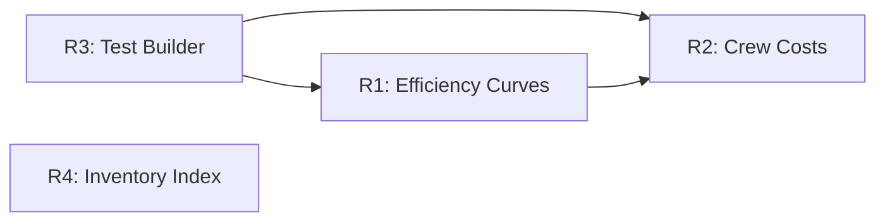

# System Quality Deepening

Four improvements to make existing systems interact meaningfully and reduce code friction. Prioritized by dependency order — infrastructure first, then gameplay depth.

## Overview

Currently, 8+ systems (mining, refining, manufacturing, research, thermal, crew, economy, wear) work correctly in isolation but create limited strategic tension. This plan deepens their interactions while reducing test boilerplate and eliminating hot-path O(n) scans.

**Key decisions from brainstorm (see origin: docs/brainstorms/2026-03-28-system-quality-deepening-requirements.md):**
- Efficiency affects output quantity, not processing time
- FE shows single percentage with hover breakdown
- Salary as economic pressure, not punishment (no crew strikes)
- Builder in test_fixtures, not derive macro

## Implementation Phases

### Phase 1: ModuleDef Test Builder (R3) — Do First

**Why first:** Every subsequent phase adds fields or modifies ModuleDef. Builder makes those changes O(1) instead of O(n) across test files.

#### Tasks

**1.1 Add builder to test_fixtures.rs**

```rust
// crates/sim_core/src/test_fixtures.rs
pub struct ModuleDefBuilder {
    def: ModuleDef,
}

impl ModuleDefBuilder {
    pub fn new(id: &str) -> Self {
        Self {
            def: ModuleDef {
                id: id.to_string(),
                name: id.to_string(),
                mass_kg: 0.0,
                volume_m3: 0.0,
                power_consumption_per_run: 0.0,
                wear_per_run: 0.0,
                behavior: ModuleBehaviorDef::Processor(ProcessorDef {
                    processing_interval_minutes: 1,
                    processing_interval_ticks: 1,
                    recipes: vec![],
                }),
                thermal: None,
                compatible_slots: Vec::new(),
                ship_modifiers: Vec::new(),
                power_stall_priority: None,
                roles: vec![],
                crew_requirement: Default::default(),
                required_tech: None,
                ports: Vec::new(),
            },
        }
    }

    pub fn behavior(mut self, b: ModuleBehaviorDef) -> Self { self.def.behavior = b; self }
    pub fn thermal(mut self, t: ThermalDef) -> Self { self.def.thermal = Some(t); self }
    pub fn power(mut self, p: f32) -> Self { self.def.power_consumption_per_run = p; self }
    pub fn wear(mut self, w: f32) -> Self { self.def.wear_per_run = w; self }
    pub fn crew(mut self, role: &str, count: u32) -> Self {
        self.def.crew_requirement.insert(CrewRole(role.to_string()), count);
        self
    }
    pub fn roles(mut self, r: Vec<&str>) -> Self {
        self.def.roles = r.into_iter().map(String::from).collect();
        self
    }
    pub fn ports(mut self, p: Vec<ModulePort>) -> Self { self.def.ports = p; self }
    pub fn build(self) -> ModuleDef { self.def }
}
```

**1.2 Migrate existing test ModuleDef literals**

Target files (55 instances across ~15 files):
- `crates/sim_core/src/test_fixtures.rs` (~15 instances)
- `crates/sim_core/src/station/processor.rs` (~5)
- `crates/sim_core/src/station/assembler.rs` (~3)
- `crates/sim_core/src/station/mod.rs` (~2)
- `crates/sim_core/src/station/thermal.rs` (~4)
- `crates/sim_core/src/station/sensor.rs`, `lab.rs` (~2)
- `crates/sim_core/src/tests/power.rs` (~7)
- `crates/sim_core/src/tests/manufacturing.rs` (~3)
- `crates/sim_core/src/tests/crew.rs`, `trade.rs`, etc.
- `crates/sim_core/src/metrics.rs` (~6)
- `crates/sim_core/src/commands.rs` (~2)
- `crates/sim_control/src/lib.rs` (~6)
- `crates/sim_control/tests/progression.rs` (~8)
- `crates/sim_world/src/lib.rs` (~3)

**Acceptance criteria:**
- [ ] `ModuleDefBuilder` added to test_fixtures.rs with chainable methods
- [ ] All 55 `ModuleDef { ... }` test literals converted to builder pattern
- [ ] Adding a new field to ModuleDef only requires updating the builder default
- [ ] All tests pass

---

### Phase 2: Module Efficiency Curves (R1)

**Why second:** This is the highest-leverage gameplay change — creates compound tradeoffs between crew, wear, thermal, and power.

#### Architecture

Replace the boolean `should_run()` gate with a continuous efficiency calculation. The existing modifier system (`resolve_with_f32`) already handles multiplicative factors — this wires crew and power into it.

```
Current flow:
  should_run() → true/false → execute() or skip

New flow:
  compute_efficiency() → 0.0–1.0 → execute() with scaled output
  (0.0 still skips entirely — preserves stall behavior)
```

#### Tasks

**2.1 Add `efficiency` field to ModuleState**

```rust
// crates/sim_core/src/types/state.rs — ModuleState
/// Combined efficiency multiplier (0.0–1.0), computed each tick.
#[serde(default = "default_efficiency")]
pub efficiency: f32,

fn default_efficiency() -> f32 { 1.0 }
```

**2.2 Implement `compute_module_efficiency()` in station/mod.rs**

```rust
// crates/sim_core/src/station/mod.rs
pub fn compute_module_efficiency(
    module: &ModuleState,
    module_def: &ModuleDef,
    power_stalled: bool,
) -> f32 {
    if power_stalled { return 0.0; }

    let crew_factor = if module_def.crew_requirement.is_empty() {
        1.0
    } else {
        let (total_needed, total_assigned) = module_def.crew_requirement.iter()
            .map(|(role, &needed)| {
                let assigned = module.assigned_crew.get(role).copied().unwrap_or(0);
                (needed, assigned.min(needed))
            })
            .fold((0u32, 0u32), |(tn, ta), (n, a)| (tn + n, ta + a));
        if total_needed == 0 { 1.0 } else { total_assigned as f32 / total_needed as f32 }
    };

    let wear_factor = crate::wear::wear_efficiency(module.wear.value);

    // crew_factor * wear_factor (thermal applied separately in processor via existing path)
    crew_factor * wear_factor
}
```

**2.3 Wire efficiency into tick_station_modules**

In `station/mod.rs`, after power budget but before module execution:
- Compute `efficiency` for each module
- Store on `module.efficiency`
- Pass to processor/assembler execute

**2.4 Apply efficiency to processor output**

In `station/processor.rs`, the existing `build_processor_modifiers` already receives `ctx.efficiency` (wear-derived). Change this to use the new combined efficiency which includes crew_factor. The thermal_efficiency is already applied separately via `RecipeThermalReq` — leave that path unchanged.

**2.5 Apply efficiency to assembler output**

In `station/assembler.rs`, assembler currently has no efficiency multiplier. Add: output count scaled by floor(count * efficiency). If efficiency rounds to 0 output, skip the run.

**2.6 Emit ModuleEfficiencyChanged event**

New event variant when efficiency changes from previous tick:
```rust
Event::ModuleEfficiencyChanged {
    station_id: StationId,
    module_id: ModuleInstanceId,
    efficiency: f32, // combined 0.0–1.0
}
```

Add noOp handler in `applyEvents.ts`, Zod schema in `eventSchemas.ts`.

**2.7 Remove `crew_satisfied` boolean**

The `crew_satisfied` field on ModuleState becomes redundant — crew_factor handles it continuously. Remove field, remove `update_crew_satisfaction()` calls, remove `CrewSatisfied`/`CrewUnsatisfied` boolean checks. Keep `ModuleUnderstaffed`/`ModuleFullyStaffed` events but emit based on crew_factor thresholds (< 1.0 / == 1.0).

**2.8 FE: Show efficiency on ModuleCard**

Add efficiency percentage to the module card in `fleet/ModuleCard.tsx`. Display as "85%" with color coding (green > 80%, yellow > 50%, red <= 50%).

**Acceptance criteria:**
- [ ] Smelter with 1/2 crew produces ~50% output in sim_bench
- [ ] Module at 80% crew + 90% wear = 72% efficiency
- [ ] Zero-efficiency modules don't execute (preserves stall)
- [ ] `crew_satisfied` field removed from ModuleState
- [ ] ModuleEfficiencyChanged event emitted + FE handles it
- [ ] All tests pass, event sync clean

---

### Phase 3: Crew Operating Costs (R2)

**Why third:** Depends on R1 (efficiency curves create the gameplay context where crew costs matter — hiring more crew improves efficiency but costs money).

#### Tasks

**3.1 Add salary_per_hour to crew_roles.json**

```json
{
  "id": "operator",
  "name": "Operator",
  "recruitment_cost": 50000,
  "salary_per_hour": 25.0
}
```

**3.2 Add salary_per_hour field to CrewRoleDef**

```rust
// crates/sim_core/src/types/content.rs — CrewRoleDef
#[serde(default)]
pub salary_per_hour: f64,
```

**3.3 Add salary deduction to tick**

New function `deduct_crew_salaries()` called in `tick()` after `apply_commands` and before `tick_stations`:

```rust
fn deduct_crew_salaries(state: &mut GameState, content: &GameContent) {
    let hours_per_tick = f64::from(content.constants.minutes_per_tick) / 60.0;
    let mut total_salary = 0.0_f64;
    for station in state.stations.values() {
        for (role, &count) in &station.crew {
            if let Some(role_def) = content.crew_roles.get(&role.0) {
                total_salary += role_def.salary_per_hour * f64::from(count) * hours_per_tick;
            }
        }
    }
    state.balance -= total_salary;
}
```

**3.4 Add StationBankrupt event**

Emit when balance crosses zero (only on the transition, not every tick):

```rust
if state.balance < 0.0 && prev_balance >= 0.0 {
    events.push(emit(&mut state.counters, state.meta.tick, Event::StationBankrupt));
}
```

**3.5 Autopilot CrewRecruitment salary awareness**

In `sim_control/src/behaviors.rs`, `CrewRecruitment` behavior should check projected salary burn rate before hiring. If hiring would cause bankruptcy within N ticks (configurable), skip.

**3.6 FE: Show salary costs in EconomyPanel**

Add "Crew Salaries" line to the economy panel showing per-hour drain alongside trade revenue.

**Acceptance criteria:**
- [ ] 30-day sim_bench shows declining balance from crew salaries
- [ ] `salary_per_hour` field loads from crew_roles.json
- [ ] StationBankrupt event emits when balance crosses zero
- [ ] Autopilot doesn't over-hire into bankruptcy
- [ ] EconomyPanel shows salary costs

---

### Phase 4: Inventory Lookup Index (R4)

**Why last:** Pure infrastructure. Benefits compound as more systems add commands, but doesn't block R1-R3.

#### Tasks

**4.1 Add module-by-ID index to StationState**

```rust
// crates/sim_core/src/types/state.rs — StationState
#[serde(skip, default)]
pub module_id_index: HashMap<ModuleInstanceId, usize>,
```

Rebuilt alongside existing `module_type_index` in `rebuild_module_index()`.

**4.2 Add inventory index**

```rust
#[serde(skip, default)]
pub inventory_index: HashMap<String, Vec<usize>>,
```

Key = element_id for Material, component_id for Component, def_id for Module. Rebuilt on any inventory mutation. Add `invalidate_inventory_index()` / `rebuild_inventory_index()` methods.

**4.3 Convert commands.rs lookups**

Replace ~10 `.iter().find()`/`.position()` calls in commands.rs with index lookups. Target locations:
- Line 71: module install (find by def_id in inventory)
- Line 161, 545: module uninstall/threshold (find by module id)
- Line 779: component transfer (find by component_id)
- Line 904, 907: thermal link (find modules by id)
- Line 1008-1009: transfer molten (find modules by id)

**Acceptance criteria:**
- [ ] Zero `.iter().find()`/`.position()` calls on inventory or module lists in commands.rs
- [ ] Index rebuilt on install/uninstall/import/export
- [ ] All tests pass with identical behavior
- [ ] `module_type_index` and `module_id_index` share rebuild trigger

---

## Dependency Graph



R3 first (unblocks everything). R1 before R2 (efficiency creates the context for crew costs). R4 independent.

## Scope Boundaries (from origin)

- **Not** adding new module types, recipes, or tech effects
- **Not** changing tick order or adding new tick steps (salary deduction fits within existing apply_commands step)
- **Not** adding UI panels — only updating existing panels
- **Not** implementing partial power or crew strikes

## Relevant Learnings

- **backward-compatible-type-evolution.md**: New fields on ModuleState/StationState use `#[serde(default)]` — efficiency field follows this pattern
- **crew-system-multi-ticket-implementation.md**: Adding fields to ModuleState requires updating 60+ test constructors — R3 builder eliminates this for future work
- **module-behavior-extensibility.md**: Dispatch through common trait patterns — efficiency calculation follows the existing ctx.efficiency pattern in processor

## Estimated Scope

| Phase | Tickets | Est. LoC Change | Risk |
|-------|---------|-----------------|------|
| R3: Test Builder | 2 (builder + migration) | +200, -400 | Low |
| R1: Efficiency | 4 (compute, processor, assembler, FE) | +300, -100 | Medium |
| R2: Crew Costs | 3 (content, tick, FE) | +150 | Low |
| R4: Inventory Index | 2 (index, conversion) | +150, -50 | Low |

Total: ~11 tickets, net LoC reduction of ~50 lines while adding significant gameplay depth.

## Sources

- **Origin document:** [docs/brainstorms/2026-03-28-system-quality-deepening-requirements.md](docs/brainstorms/2026-03-28-system-quality-deepening-requirements.md) — key decisions: output quantity scaling, single percentage display, salary as pressure not punishment
- `crates/sim_core/src/station/mod.rs:707-731` — current `should_run()` implementation
- `crates/sim_core/src/wear.rs:7-15` — `wear_efficiency()` returning f32
- `crates/sim_core/src/thermal.rs:54-67` — `thermal_efficiency()` returning f32
- `crates/sim_core/src/station/processor.rs:143-248` — current efficiency usage via modifiers
- `content/crew_roles.json` — current crew role structure (needs salary_per_hour)
- `crates/sim_core/src/types/state.rs:396-415` — ModuleTypeIndex pattern for R4
